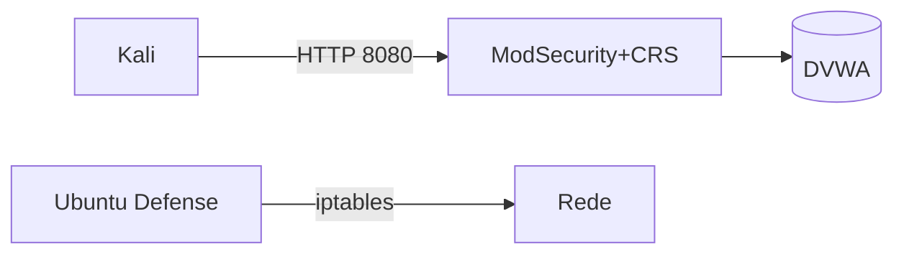

> Grupo: <nome> · Data: <AAAA‑MM‑DD>

## 1. Sumário Executivo
- Visão geral do ambiente, ataques simulados e nível de proteção alcançado.

## 2. Objetivo e Escopo
- O que foi defendido, o que foi atacado, limites do exercício.

## 3. Arquitetura (Diagrama)

- Descreva camadas e fluxos.

## 4. Metodologia
- Passos executados (detecção → bloqueio → resposta), critérios de sucesso.

## 5. Execução e Evidências
- SQLi e XSS (detalhes, prints, resultados)
- Modo blocking (403 + logs CRS)
- iptables/tcpdump, tuning, decisões

## 6. Resposta a Incidente (NIST IR)
- Detecção, Contenção, Erradicação, Recuperação, Lições Aprendidas

## 7. Recomendações (80/20)
- Top 5 ações com esforço vs. impacto

## 8. Conclusão
- Maturidade demonstrada e próximos passos

## Anexos
- Configs, logs, scripts
